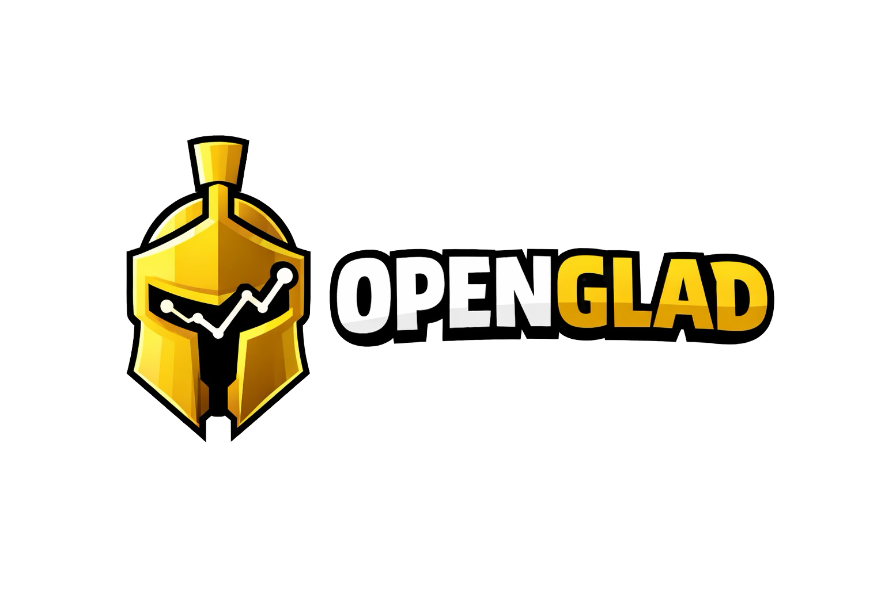

<p align="center">
  
  <p align="center"><strong>The Loss-Prevention Friction Engine for Founders</strong></p>
  <p align="center">
    An AI-powered MCP server that stops you from building things nobody wants using clinical analytics, behavioral pattern scanning, and real-time Reddit market intelligence.
  </p>
  <p align="center">
    <a href="#tools">Tools</a> •
    <a href="#quickstart">Quickstart</a> •
    <a href="#architecture">Architecture</a> •
    <a href="#deployment">Deployment</a>
  </p>
</p>

<p align="center">
  
</p>

---

## What is openGlad?

openGlad is a **Model Context Protocol (MCP) server** that acts as the ultimate friction engine for startups. It provides AI agents (Claude, Cursor, Windsurf, Le Chat, etc.) with specialized tools to enforce loss-prevention *before* you write a single line of code:

- 🛑 **Loss-Prevention Pipeline** — Runs behavioral pattern scans, 3-scenario failure predictions, and locks building until monetization is confirmed.
- 🔍 **Market Reality Check** — Fetches and analyzes real Reddit discussions across 11 entrepreneurship subreddits to detect overcrowding and entry risks.
- 📊 **Startup Diagnostics** — Evaluates execution stability, revenue health, burnout risk, and distribution discipline.
- 🩺 **Clinical Triage** — Objective, data-driven assessments with zero motivational fluff.

> Think of it as an **anti-delusion engine for your startup** — designed to tell you 'no' before you waste months building the wrong thing.

## Architecture

```
┌──────────────┐         ┌───────────────────────┐
│   AI Client  │  MCP    │   openGlad Worker     │
│  (Claude,    │◄──────►│   (Cloudflare Edge)   │
│   Cursor,    │         │      Version 4.0      │
│   Windsurf)  │         └───────────┬───────────┘
└──────────────┘                     │ Direct fetch
                                     │ (cached 1hr)
                              ┌──────▼───────┐
                              │    Reddit    │
                              │ Public JSON  │
                              │  11 Subs     │
                              └──────────────┘
```

**Tech Stack:**
- **Runtime**: Cloudflare Workers (edge-deployed, globally distributed)
- **Protocol**: MCP (Model Context Protocol) via Streamable HTTP
- **Market Data**: Reddit Public JSON API (direct fetch, 1-hour edge cache)
- **Language**: TypeScript (Modular Architecture)

## Tools

### 🚧 Friction Engine (Loss Prevention)

| Tool | Description | Reddit Data |
|------|-------------|:-----------:|
| `run_the_bet` | Mega-pipeline combining Pattern Scan, Loss Simulation, and Revenue Gate with Reddit market data. **Start here for new ideas.** | Yes |
| `pattern_scan` | Detects behavioral risk patterns (overbuilding drift, monetization avoidance, prestige bias). | No |
| `loss_simulation` | Generates 3-scenario failure predictions (best, likely, worst) with quantified expected loss. | Yes |
| `revenue_gate` | Locks building until clear monetization strategy is confirmed. Produces unlock tasks. | No |

### 🔍 Market Intelligence (Reddit-powered)

| Tool | Description | Reddit Data |
|------|-------------|:-----------:|
| `analyze_market_trends` | Overcrowding & entry risk filter. Detects tarpit ideas and late entry risks. | Yes |
| `scan_reddit_trends` | Broad trend scanner: sentiment, red flags, cautionary tales, and 6-12 month predictions. | Yes |

**Data Sources** — 11 subreddits searched:

`r/Startup_Ideas` · `r/Business_Ideas` · `r/SaaS` · `r/SideProject` · `r/EntrepreneurRideAlong` · `r/IndieHackers` · `r/Futurology` · `r/Technology` · `r/AINewsAndTrends` · `r/Startups` · `r/Entrepreneur`

### 🩺 Startup Diagnostics

| Tool | Description |
|------|-------------|
| `analyze_startup` | Smart triage router. Auto-detects ideas vs metrics and routes accordingly. |
| `analyze_execution_stability` | Assesses development velocity, engineering risks, and technical debt. |
| `analyze_revenue_health` | Evaluates MRR/ARR trajectory, financial risks, churn, and unit economics. |
| `analyze_burnout_risk` | Detects burnout signals from work patterns, cognitive load, and focus entropy. |
| `analyze_distribution_discipline` | Measures marketing risks, output consistency, and funnel efficiency. |
| `generate_full_diagnosis` | Comprehensive system scan across all diagnostic dimensions. |

### 💬 MCP Prompts

| Prompt | Description |
|--------|-------------|
| `run-the-bet` | Full loss-prevention pipeline for a new idea. |
| `market-check` | Market saturation and trend analysis combining broad scan + focused analysis. |
| `should-i-build` | Quick friction check: pattern scan + revenue gate to determine if building is allowed. |
| `analyze-startup` | Guided startup analysis — triage and routing for ideas or metrics. |

### 📖 MCP Resources

| Resource | URI | Description |
|----------|-----|-------------|
| Usage Guide | `openglad://guide` | Agent-readable guide with tool selection logic, recommended workflows, and usage tips. |

## Quickstart

### Connect to the hosted server

The MCP server is deployed and ready to use:

```
https://openglad.tuguberk.dev/mcp
```

#### Claude Desktop / Cursor / Windsurf / Any MCP Client

Add to your MCP client configuration:

```json
{
  "mcpServers": {
    "openGlad": {
      "command": "npx",
      "args": ["-y", "mcp-remote", "https://openglad.tuguberk.dev/mcp"]
    }
  }
}
```

#### MCP Inspector (for testing)

```bash
npx @modelcontextprotocol/inspector@latest
# Enter URL: https://openglad.tuguberk.dev/mcp
```

### Example Prompts

Once connected, try these with your AI client:

```
"Run the bet on my startup idea: an AI-powered tool that generates investor pitch decks from a one-page brief"
```

```
"Can you check if my idea for a daily planner app is going to fail?"
```

```
"Run a full health diagnostic on my startup with these metrics: MRR $12k, churn 8%, 3 developers, shipping weekly"
```

```
"Is the micro-SaaS market oversaturated? Check Reddit trends for me."
```

## Deployment

### Prerequisites

- [Node.js](https://nodejs.org/) 18+
- [Cloudflare account](https://dash.cloudflare.com/)

### Deploy your own

```bash
# Clone and install
git clone https://github.com/tugberkakbulut/openGlad.git
cd openGlad
npm install

# Local development
npm run dev

# Deploy to Cloudflare
npx wrangler deploy
```

No API keys required — openGlad fetches Reddit data directly via public JSON endpoints. Results are cached at the edge for 1 hour.

### Project Structure

```
openGlad/
├── src/
│   ├── config/            # Environment & constants
│   ├── prompts/           # LLM system prompts & templates
│   ├── services/          # Reddit search & caching
│   ├── tools/             # MCP Tool definitions & handlers
│   ├── utils/             # Helper functions
│   └── index.ts           # Server entry point, prompts, resources & tool registration
├── wrangler.jsonc          # Cloudflare Worker configuration
├── package.json
└── tsconfig.json
```

## How It Works

### Friction Engine Flow (Loss-Prevention)

1. **User asks** → *"I want to build an AI resume builder"*
2. **AI client** → Calls `run_the_bet` or `analyze_startup`
3. **openGlad Worker** → Fetches relevant Reddit discussions across 11 subreddits (cached 1hr at edge)
4. **Pattern Scan** → Identifies behavioral risks (overbuilding, monetization avoidance)
5. **Loss Simulation** → Maps out 3 failure scenarios with quantified expected loss using Reddit market data
6. **Revenue Gate** → Locks building until monetization is proven
7. **User receives** → A brutal reality check: blind spots, failure modes, and whether they're allowed to build

## Built With

- **[Cloudflare Workers](https://workers.cloudflare.com/)** — Serverless edge computing
- **[Model Context Protocol](https://modelcontextprotocol.io/)** — Standard protocol for AI tool integration
- **[Cloudflare Agents SDK](https://developers.cloudflare.com/agents/)** — MCP server framework
- **[Reddit Public JSON API](https://www.reddit.com/dev/api/)** — Real-time market intelligence

## License

MIT
